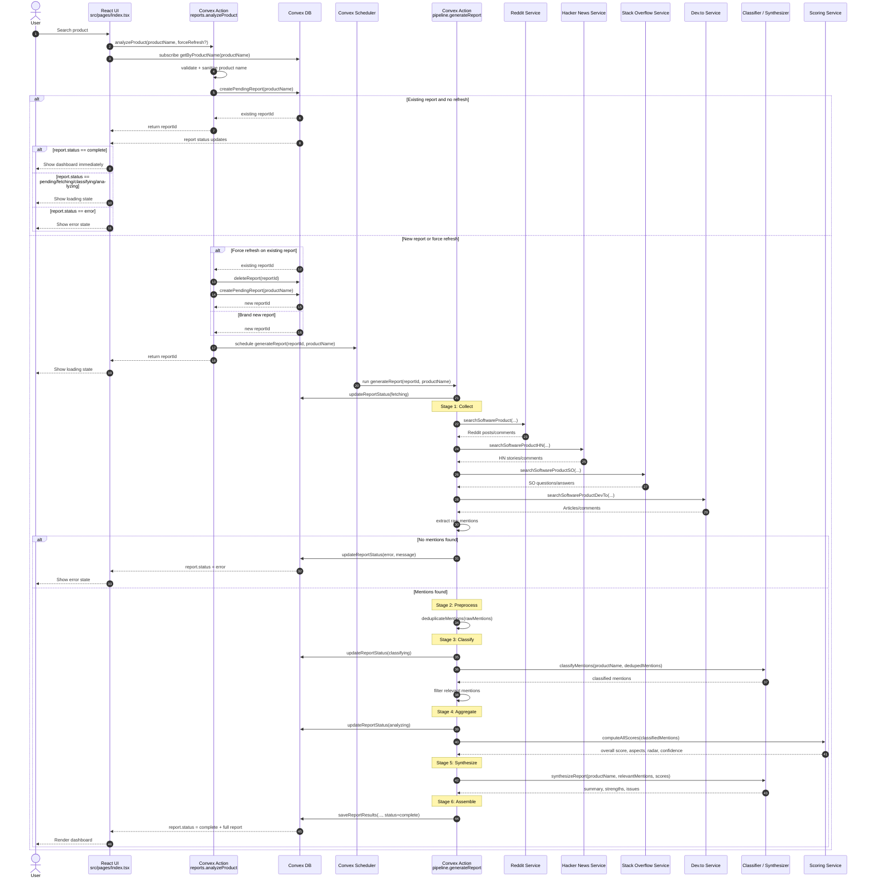

# Pipeline Sequence Diagram

This diagram reflects the current search-to-report flow implemented in `src/pages/Index.tsx`, `convex/reports.ts`, and `convex/pipeline.ts`.

```mermaid
sequenceDiagram
    autonumber
    actor U as User
    participant UI as React UI<br/>src/pages/Index.tsx
    participant R as Convex Action<br/>reports.analyzeProduct
    participant DB as Convex DB
    participant S as Convex Scheduler
    participant P as Convex Action<br/>pipeline.generateReport
    participant RD as Reddit Service
    participant HN as Hacker News Service
    participant SO as Stack Overflow Service
    participant DT as Dev.to Service
    participant CL as Classifier / Synthesizer
    participant SC as Scoring Service

    U->>UI: Search product
    UI->>R: analyzeProduct(productName, forceRefresh?)
    UI->>DB: subscribe getByProductName(productName)

    R->>R: validate + sanitize product name
    R->>DB: createPendingReport(productName)

    alt Existing report and no refresh
        DB-->>R: existing reportId
        R-->>UI: return reportId
        DB-->>UI: report status updates
        alt report.status == complete
            UI-->>U: Show dashboard immediately
        else report.status == pending/fetching/classifying/analyzing
            UI-->>U: Show loading state
        else report.status == error
            UI-->>U: Show error state
        end
    else New report or force refresh
        alt Force refresh on existing report
            DB-->>R: existing reportId
            R->>DB: deleteReport(reportId)
            R->>DB: createPendingReport(productName)
            DB-->>R: new reportId
        else Brand new report
            DB-->>R: new reportId
        end

        R->>S: schedule generateReport(reportId, productName)
        R-->>UI: return reportId
        UI-->>U: Show loading state

        S->>P: run generateReport(reportId, productName)

        P->>DB: updateReportStatus(fetching)

        Note over P: Stage 1: Collect
        P->>RD: searchSoftwareProduct(...)
        RD-->>P: Reddit posts/comments
        P->>HN: searchSoftwareProductHN(...)
        HN-->>P: HN stories/comments
        P->>SO: searchSoftwareProductSO(...)
        SO-->>P: SO questions/answers
        P->>DT: searchSoftwareProductDevTo(...)
        DT-->>P: Articles/comments
        P->>P: extract raw mentions

        alt No mentions found
            P->>DB: updateReportStatus(error, message)
            DB-->>UI: report.status = error
            UI-->>U: Show error state
        else Mentions found
            Note over P: Stage 2: Preprocess
            P->>P: deduplicateMentions(rawMentions)

            Note over P: Stage 3: Classify
            P->>DB: updateReportStatus(classifying)
            P->>CL: classifyMentions(productName, dedupedMentions)
            CL-->>P: classified mentions
            P->>P: filter relevant mentions

            Note over P: Stage 4: Aggregate
            P->>DB: updateReportStatus(analyzing)
            P->>SC: computeAllScores(classifiedMentions)
            SC-->>P: overall score, aspects, radar, confidence

            Note over P: Stage 5: Synthesize
            P->>CL: synthesizeReport(productName, relevantMentions, scores)
            CL-->>P: summary, strengths, issues

            Note over P: Stage 6: Assemble
            P->>DB: saveReportResults(..., status=complete)

            DB-->>UI: report.status = complete + full report
            UI-->>U: Render dashboard
        end
    end
```
