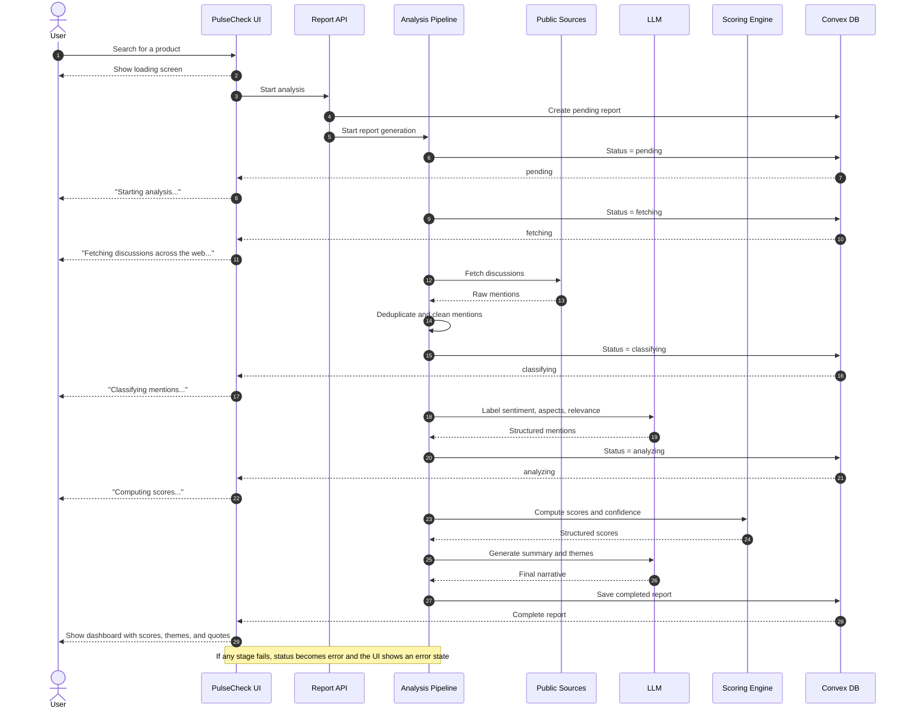

# Pipeline Sequence Diagram (Presentation Version)

This version follows the primary first-search user experience and emphasizes what the user sees on screen.

```mermaid
sequenceDiagram
    autonumber
    actor User
    participant UI as PulseCheck UI
    participant Reports as Report API
    participant Pipeline as Analysis Pipeline
    participant Sources as Public Sources
    participant AI as LLM
    participant Scoring as Scoring Engine
    participant DB as Convex DB

    User->>UI: Search for a product
    UI-->>User: Show loading screen
    UI->>Reports: Start analysis
    Reports->>DB: Create pending report
    Reports->>Pipeline: Start report generation

    Pipeline->>DB: Status = pending
    DB-->>UI: pending
    UI-->>User: "Starting analysis..."

    Pipeline->>DB: Status = fetching
    DB-->>UI: fetching
    UI-->>User: "Fetching discussions across the web..."
    Pipeline->>Sources: Fetch discussions
    Sources-->>Pipeline: Raw mentions

    Pipeline->>Pipeline: Deduplicate and clean mentions

    Pipeline->>DB: Status = classifying
    DB-->>UI: classifying
    UI-->>User: "Classifying mentions..."
    Pipeline->>AI: Label sentiment, aspects, relevance
    AI-->>Pipeline: Structured mentions

    Pipeline->>DB: Status = analyzing
    DB-->>UI: analyzing
    UI-->>User: "Computing scores..."
    Pipeline->>Scoring: Compute scores and confidence
    Scoring-->>Pipeline: Structured scores

    Pipeline->>AI: Generate summary and themes
    AI-->>Pipeline: Final narrative

    Pipeline->>DB: Save completed report
    DB-->>UI: Complete report
    UI-->>User: Show dashboard with scores, themes, and quotes

    Note over Pipeline,UI: If any stage fails, status becomes error and the UI shows an error state
```
